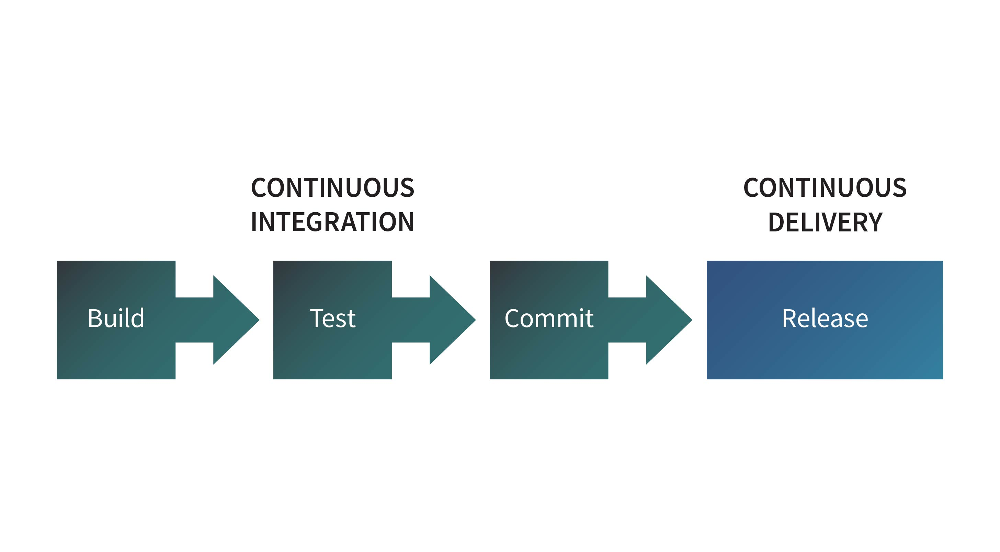

## Introduction to CI/CD
A key component of DevOps is a **C**ontinuous **I**ntegration and **C**ontinuous **D**eployment (CI/CD). CI/CD pipelines are designed to improve software delivery by automating steps for building, testing, production, and monitoring of the software development lifecycle. This enables teams to develop code faster and more reliably while bringing development and operational teams together.

See Linode's guide on an **[Introduction to Continuous Integration and Continuous Delivery (CI/CD)](https://www.linode.com/docs/guides/introduction-ci-cd/)** for help getting started.

---
[Back Home](./README.md)
